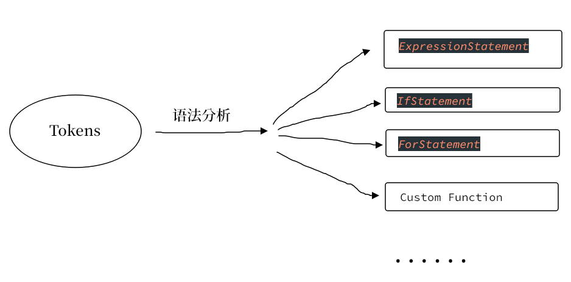
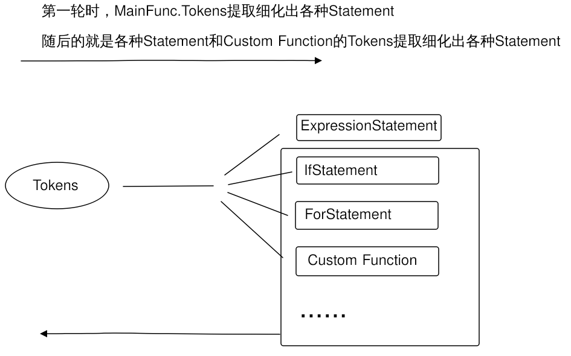

# 语法分析 Statement
Statement: 语句，if语句, for循环语句, return 语句, continue语句, break语句等等。。。
```
    ExpressionStatement // 表达式语句
    IfStatement // if语句
    ForStatement // for循环语句
    ForeachStatement // 遍历语句
    ForIndexStatement // 索引遍历语句
    ForItemStatement // 值遍历语句
    SwitchStatement // switch 语句
    MultiStatement // 多重语句
    ContinueStatement // continue 语句
    BreakStatement // break 语句
    ReturnStatement // 返回语句
```


Quick 源码由多个Statement组成，或者由多个Statement与自定义函数组成，如下：  
示例一
```js
a = 3
b = 4
c = a * b
println("c -> ", c)
```
示例二
```js
add(num1, num2) {
    return num1 + num2
}
c = add(4, 5)
println("c -> ", c)
```

### 从Token列表提取Statement

假设从词法分析得来的Token列表为 Main Function的Token列表  
Main Function的Token列表又通过语法分析if语句，表达式语句，自定义函数等等。。。  
而if语句等语句又可能包含for循环语句，if 语句等等...  
故 从Token列表提取Statement 这部分逻辑必须重用，通过递归进行重用  
最终实现时分如下两步：
1. 从Token列表提取Statement
2. 提取出来的Statement都要细化至表达式语句(ExpressionStatement)
> 表达式语句(ExpressionStatement): 只包含一个表达式的语句，是Statement到Expression的过渡

数据结构三个定义：StatementList, Function, Statement  
Function, Statement继承自StatementList  
Function是函数的抽象  
Statement是各种语句的抽象  
StatementList的定义
```go
type StatementList interface {
	stmts() []*Statement // 语句列表
	addStatement(*Statement) // 添加语句至语句列表
	getRaw() []Token // 获取StatementList的Token列表
	setRaw([]Token) // 设置StatementList的Token列表
	isCompiled() bool // 该StatementList是否完成语法分析
	setCompiled() // 标记为已完成语法分析
}
```
Function的定义
```go
type Statement struct {
    t StatementType
    expr *Expression // 用于expressionStatement.
    preExprTokens []Token // 用于普通for语句
    condExprTokens []Token // 用于if,for语句
    postExprTokens []Token // 用于普通for语句
    preExpr *Expression  // 用于for语句
    condExpr *Expression // 用于if,for语句
    postExpr *Expression // 用于for语句
    condStmts []*Statement // 用于if, switch语句
    defStmt *Statement // 用于if, switch语句
    block []*Statement // stmt核心组成(编译后的信息)
    raw []Token // stmt核心组成, token列表(编译前的信息)
    compiled bool // 该语句是否已编译
    fpi *ForPlusInfo // 增强for, 相关的信息
}
```
Statement的定义
```go
type Statement struct {
    t StatementType
    expr *Expression // 用于expressionStatement.
    preExprTokens []Token // 用于普通for语句
    condExprTokens []Token // 用于if,for语句
    postExprTokens []Token // 用于普通for语句
    preExpr *Expression  // 用于for语句
    condExpr *Expression // 用于if,for语句
    postExpr *Expression // 用于for语句
    condStmts []*Statement // 用于if, switch语句
    defStmt *Statement // 用于if, switch语句
    block []*Statement // stmt核心组成(编译后的信息)
    raw []Token // stmt核心组成, token列表(编译前的信息)
    compiled bool // 该语句是否已编译
    fpi *ForPlusInfo // 增强for, 相关的信息
}
```


关键代码如下
```go
func Compile(stmts StatementList) {
	if stmts == nil {
		return
	}
	if stmts.isCompiled() {
		return
	} else {
		stmts.setCompiled()
	}
	extractStatement(stmts)
	parseStatementList(stmts.stmts())

	for _, customFunc := range funcList {
		Compile(customFunc)
	}
}
```
```go
func extractStatement(stmts StatementList) {
	ts := stmts.getRaw()
	for i := 0; i < len(ts); {
		t := ts[i]
		var endIndex int
		var stmt *Statement

		if !t.isIdentifier() && !t.isComplex() {
			goto nextLoop
		}
		switch t.str {
		case "if":
			stmt, endIndex = extractIfStatement(i, ts)
		case "for":
			stmt, endIndex = extractForStatement(i, ts)
		case "foreach":
			stmt, endIndex = extractForeachStatement(i, ts)
		case "fori":
			stmt, endIndex = extractForindexStatement(i, ts)
		case "forv":
			stmt, endIndex = extractForitemStatement(i, ts)
		case "switch":
		case "continue":
			stmt, endIndex = extractContinueStatement(i, ts)
		case "break":
			stmt, endIndex = extractBreakStatement(i, ts)
		case "return":
			stmt, endIndex = extractReturnStatement(i, ts)
		default:
			if t.isFdef() {
				// 提取 函数定义
				f, endIndex1 := extractFunction(i, ts)
				funcList[f.name] = f
				i = endIndex1
				goto nextLoop
			}
			// 提取 表达式语句
			stmt, endIndex = extractExpressionStatement(i, ts)

		}
		if endIndex > 0 {
			stmts.addStatement(stmt)
			i = endIndex
		}

	nextLoop:
		i++
	}
}
```
```go
func parseStatementList(stmts []*Statement) {
	for _, stmt := range stmts {
		parseStatement(stmt)
	}
}

func parseStatement(stmt *Statement) {
	ts := stmt.raw
	switch {
	case stmt.isExpressionStatement():
		stmt.expr = extractExpression(ts)

	case stmt.isIfStatement():
		parseIfStatement(stmt)

	case stmt.isForStatement():
		parseForStatement(stmt)

	case stmt.isForeachStatement() || stmt.isForIndexStatement() || stmt.isForItemStatement():
		parseForPlusStatement(stmt)

	case stmt.isSwitchStatement():
	case stmt.isReturnStatement():
		parseReturnStatement(stmt)
	}
}

func parseIfStatement(stmt *Statement) {
	for _, condStmt := range stmt.condStmts {
		condStmt.condExpr = extractExpression(condStmt.condExprTokens)
		Compile(condStmt)
	}

	if stmt.defStmt==nil {
		return
	}
	Compile(stmt.defStmt)
}
```


