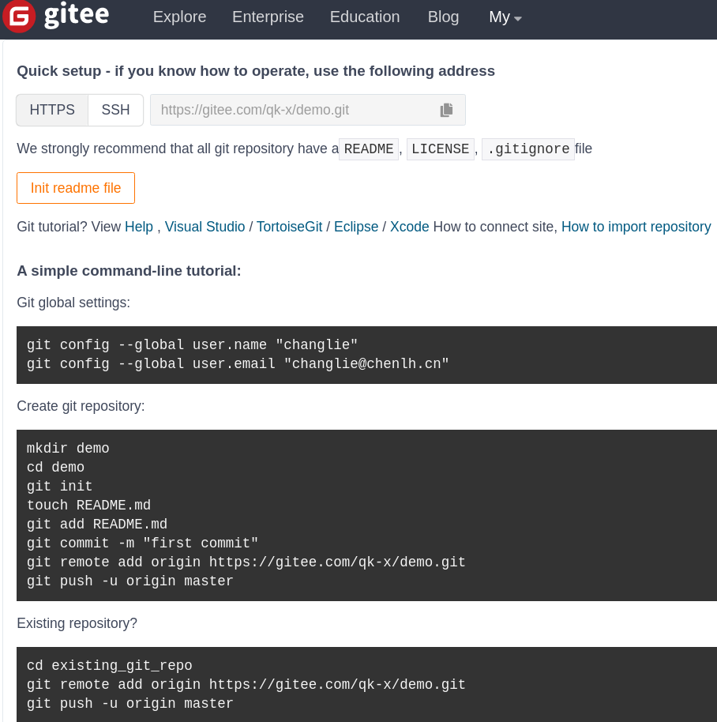

# git中常见的origin, master

参考  
[origin知乎问答](https://www.zhihu.com/question/27712995)  
[Git 的origin和master分析](https://blog.csdn.net/abo8888882006/article/details/12375091)

### 结论
> origin 默认情况下的远端库的名字。远端库也可以用其他名字，用 origin 只是因为他是默认的，使用广泛而已。  
> master 是当你运行 `git init` 时默认的起始分支名字, 它和其他分支对git而言，并无特别之处。

### 分析
对git的操作是大概围绕3个大的步骤来展开的

1. 从git服务器仓库取数据（git clone）
2. 改动代码
3. 将改动保存至git服务器仓库（git push）

这3个步骤又涉及到两个repository，一个是 `remote repository`，在远程服务器上，一个是`local repository`，在自己工作区上.

其中1, 3两个步骤涉及到`remote server`/`remote repository`/`remote branch`与`local repository`/`local branch`。  
2涉及到`local repository`/`local branch`。  

`git clone` 会根据你指定的`remote server/repository/branch`，拷贝一个副本到你本地，在`git push`之前，你对所有文件的改动都是在你自己本地的`local repository`来做的,`local branch`和`remote branch`是相互独立的。

##### 举个例子
```
git clone https://github.com/username/spring.git
```

在clone完成之后，Git 会自动为你将此远程仓库命名为origin `（origin只相当于一个别名，运行git remote –v或者查看.git/config可以看到origin的含义）`，并下载其中所有的数据，建立一个指向它的master 分支的指针，我们用(远程仓库名)/(分支名) 这样的形式表示远程分支，所以origin/master指向的是一个remote branch。

同时，Git 会在`local repository`建立一个master 分支，它指向的是`remote repository`的master分支。

##### 再举个例子
当我们在 gitee新建个仓库时  


`git remote add origin https://gitee.com/qk-x/demo.git`这个命令的意思是将本地库与远程库相关联，并且远程库`https://gitee.com/qk-x/demo.git`命名为origin

`git push -u origin master`这个命令的意思是将本地库master的分支指向远程库master的分支，然后下次我们将本地库master的分支提交到远程库master的分支时，直接用`git push`命令即可，无需在git push后面指定远程库名与远程分支名。（`git push -u`等效于`git push --set-upstream`）