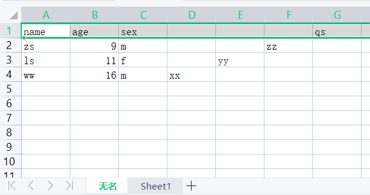
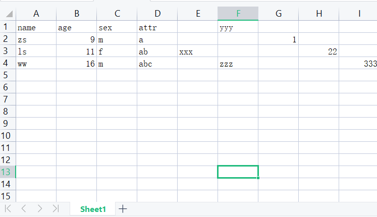
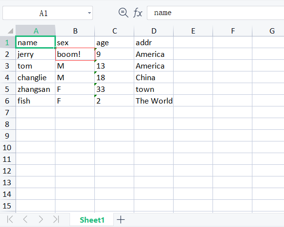

# Excel 操作

excel文件 实际是一堆xml文件的压缩包

Quick支持对老版xls的读操作，及最新版xlsx文件的读写操作
* [Excel - Xls](201-excel-xls.md)
* [Excel - Xlsx](202-excel-xlsx.md)

### xls 数据读取
`tab1.xls`文件内容如下：  
  
[源文件](../static/tab1.xls)
```js
f = xls("d:/tab1.xls")
println("xlsSheetNumber:", f.sheetNumber())
sheet = f.sheet(0)
println("sheetName: ", sheet.name())
println("sheetRowNumber: ", sheet.rowNumber())
row = sheet.row(0)
if row {
    println("headers:")
    forv cell : row.cols() {
        cell && print(cell.str()+", ")
    }
}

println("\ndata:")
rows = sheet.rows()
forv row : rows {
    cells = row.cols()
    forv cell : cells {
        cell && print(cell.str()+", ")
    }
    println("\n=============================")
}
```
输出
```
xlsSheetNumber: 2
sheetName:  无名
sheetRowNumber:  4
headers:
name, age, sex, , , , qs, 
data:
zs, 9, m, , , zz, 
=============================
ls, 11, f, , yy, 
=============================
ww, 16, m, xx, 
=============================
```

### xlsx 读取
`tab2.xlsx`文件内容：
  
[源文件](../static/tab2.xlsx)
方式1：
```js
f = xlsx("d:/tab2.xlsx")
sheet = f.sheet(0)
forv row : sheet.cellVals() {
    printf("[%v] ", row.size())
    forv cell : row {
        print(cell+", ")
    }
    println("\n=====================")
}
```
输出
```
[6] name, age, sex, attr, , yyy, 
=====================
[7] zs, 9, m, a, , , 1, 
=====================
[8] ls, 11, f, ab, xxx, , , 22, 
=====================
[9] ww, 16, m, abc, , zzz, , , 333, 
=====================
```
方式2：
```js
f = xlsx("d:/tab2.xlsx")
sheet = f.sheet(0)
rows = sheet.rows()
for rows.next() {
    cells = rows.cols()
    println(cells, cells.type())
}
```
输出
```
["name", "age", "sex", "attr", "", "yyy"] JSONArray
["zs", "9", "m", "a", "", "", "1"] JSONArray
["ls", "11", "f", "ab", "xxx", "", "", "22"] JSONArray
["ww", "16", "m", "abc", "", "zzz", "", "", "333"] JSONArray
```

### xlsx 写数据
```js
headers = ["name", "sex", "age", "addr"]
data = [
{name:"jerry", sex:"F", age:9, addr:"America"},
{name:"tom", sex:"M", age:13, addr:"America"},
{name:"changlie", sex:"M", age:18, addr:"China"},
{name:"zhangsan", sex:"F", age:33, addr:"town"},
{name:"fish", sex:"F", age:2, addr:"The World"},
]

f = newXlsx()
sheet = f.sheet(0)
// 批量写数据
sheet.setData(headers, data)
// 修改一个单元的数据
// 修改横坐标为B，纵坐标为2的单元格的值为"boom!"
sheet.setCellValue("B2", "boom!")
f.saveAs("d:/test.xlsx")
println("write successfully")
```
写出的文件数据如下：
